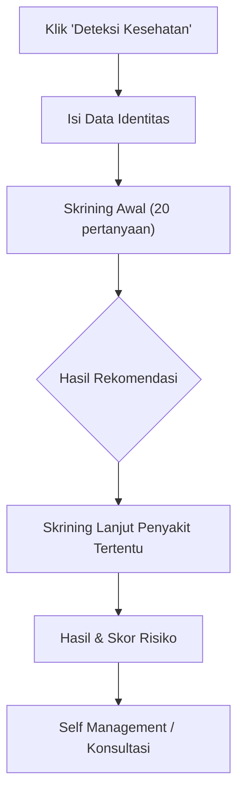
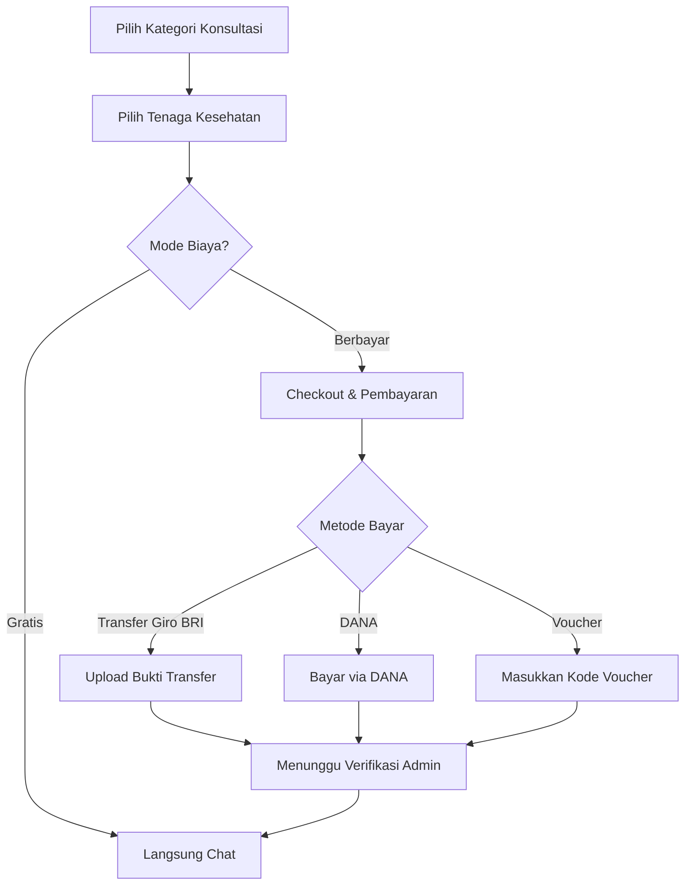
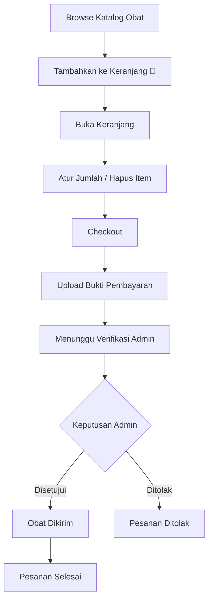
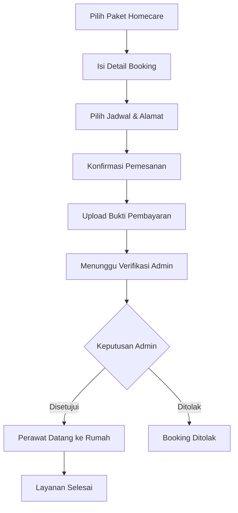
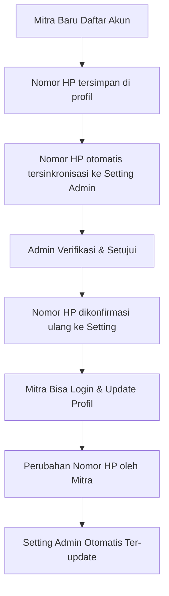

# 📘 Panduan Lengkap Aplikasi Nersia Health
### Chatbot Smart Health Screening & Care

---

## Daftar Isi

1. [Pendahuluan](#1-pendahuluan)
2. [Registrasi & Login](#2-registrasi--login)
3. [Halaman Beranda (Home)](#3-halaman-beranda-home)
4. [Fitur Deteksi Kesehatan (Skrining)](#4-fitur-deteksi-kesehatan-skrining)
5. [Riwayat Skrining](#5-riwayat-skrining)
6. [Self Management](#6-self-management)
7. [Monitoring Kesehatan](#7-monitoring-kesehatan)
8. [Konsultasi Kesehatan](#8-konsultasi-kesehatan)
9. [Layanan Apotek (Pemesanan Obat)](#9-layanan-apotek-pemesanan-obat)
10. [Layanan Homecare](#10-layanan-homecare)
11. [Edukasi Kesehatan](#11-edukasi-kesehatan)
12. [Profil Pengguna](#12-profil-pengguna)
13. [Nomor Darurat](#13-nomor-darurat)
14. [Panel Admin](#14-panel-admin)
15. [Pengaturan Mitra & WhatsApp](#15-pengaturan-mitra--whatsapp)

---

## 1. Pendahuluan

**Nersia Health** adalah aplikasi web berbasis **Laravel** yang dirancang untuk membantu masyarakat melakukan skrining kesehatan secara mandiri melalui chatbot interaktif, konsultasi langsung dengan tenaga kesehatan, pemesanan obat dari apotek mitra, dan layanan homecare (panggilan perawat ke rumah).

### Teknologi Utama
| Komponen | Teknologi |
|---|---|
| Framework | Laravel (PHP) |
| Frontend | Blade Templates + Alpine.js + Tailwind CSS |
| Database | MySQL / MariaDB |
| Notifikasi | WhatsApp API (Fonnte / Wablas) |
| Pembayaran | Transfer Giro BRI / DANA |

### Jenis Pengguna (Role)

| Role | Keterangan | Perlu Verifikasi Admin? |
|---|---|---|
| 🧑‍🦰 **Pasien** | Pengguna umum untuk skrining & konsultasi | ❌ Tidak |
| 👩‍⚕️ **Perawat** | Tenaga kesehatan perawat (Ners) | ✅ Ya |
| 🩺 **Dokter** | Dokter umum atau spesialis | ✅ Ya |
| 💊 **Apotek** | Mitra apotek (UMLA FARMA) | ✅ Ya |
| 🏠 **Homecare** | Mitra homecare (Medical Center) | ✅ Ya |
| 🛡️ **Admin** | Super Admin pengelola sistem | ✅ Ya (diberikan oleh admin lain) |

---

## 2. Registrasi & Login

### 2.1 Halaman Registrasi
**URL:** `/register`

1. Buka halaman registrasi.
2. Pilih jenis akun yang ingin didaftarkan:
   - **Pasien** — Akun untuk skrining & konsultasi
   - **Perawat** — Akun tenaga kesehatan perawat
   - **Dokter** — Akun dokter umum / spesialis
   - **Apotek** — Akun mitra apotek
   - **Homecare** — Akun mitra homecare

3. Isi formulir registrasi:
   - **Nama lengkap** (wajib)
   - **Email** (wajib, unik)
   - **No. HP / WhatsApp** (wajib)
   - **Password** (wajib, minimal 8 karakter)
   - **Jenis kelamin** (untuk pasien)
   - **Tanggal lahir** (untuk pasien — usia dihitung otomatis)
   - **Alamat lengkap** (opsional)
   - **Bidang/jabatan** (untuk perawat & dokter)

4. Klik **Daftar**.

> [!IMPORTANT]
> Untuk role selain **Pasien**, akun akan berstatus **menunggu verifikasi admin**. Anda tidak bisa login sampai admin menyetujui pendaftaran Anda.

### 2.2 Halaman Login
**URL:** `/login`

1. Masukkan **Email** atau **Nomor HP**.
2. Masukkan **Password**.
3. Klik **Masuk**.

> [!TIP]
> Jika lupa password, klik **"Lupa Password?"** untuk menerima link reset password melalui email.

---

## 3. Halaman Beranda (Home)

**URL:** `/` (root)

Halaman utama menampilkan:

### 3.1 Hero Banner
- Sapaan "Hi, Saya **Nersia Health**"
- Deskripsi: *Chatbot Smart Health Screening & Care*
- Karakter robot animasi sebagai maskot

### 3.2 Menu Fitur Unggulan (6 kartu)

| # | Fitur | Deskripsi | URL |
|---|---|---|---|
| 1 | 🔍 **Deteksi Kesehatan** | Cek kondisi kesehatan Anda | `/deteksi` |
| 2 | 📋 **Riwayat Kesehatan** | Lihat riwayat deteksi Anda | `/riwayat` |
| 3 | 💊 **Layanan Apotek** | Beli obat & vitamin online | `/obat` |
| 4 | 🏠 **Layanan Homecare** | Panggil perawat ke rumah | `/homecare` |
| 5 | 🎓 **Edukasi Kesehatan** | Video edukasi kesehatan | `/edukasi` |
| 6 | 💬 **Konsultasi Langsung** | Tanya langsung ke ahli | `/konsultasi` |

### 3.3 Tips Kesehatan
- Carousel berputar otomatis setiap 5 detik
- Menampilkan tips-tips kesehatan harian

### 3.4 Navigasi Bawah (Bottom Navigation)
Tersedia di semua halaman pasien:

| Icon | Label | Fungsi |
|---|---|---|
| 🏠 | Beranda | Kembali ke halaman utama |
| 🔍 | Deteksi | Mulai skrining kesehatan |
| 📊 | Self Mgmt | Self management penyakit |
| 💬 | Konsultasi | Konsultasi tenaga kesehatan |
| 🎓 | Edukasi | Video & artikel edukasi |
| 👤 | Profil | Lihat profil & riwayat |

---

## 4. Fitur Deteksi Kesehatan (Skrining)

### 4.1 Alur Skrining

### 4.2 Langkah Demi Langkah

#### Langkah 1: Isi Data Identitas
**URL:** `/deteksi/identitas`

Isi data diri berikut:
- Nama lengkap
- Usia
- Jenis kelamin
- Alamat (Provinsi → Kabupaten → Kecamatan → Kelurahan — dropdown bertingkat)
- Pekerjaan
- No. telepon

Klik **Lanjutkan** untuk menyimpan identitas dan memulai skrining.

#### Langkah 2: Skrining Awal
**URL:** `/deteksi/skrining-awal`

- Menjawab **20 pertanyaan** awal tentang gejala dan faktor risiko umum.
- Format: **Ya / Tidak** untuk setiap pertanyaan.
- Chatbot akan menuntun satu per satu.
- Hasil skrining awal akan merekomendasikan skrining lanjut yang sesuai.

#### Langkah 3: Skrining Lanjut
**URL:** `/deteksi/{penyakit}/skrining`

Setelah skrining awal, sistem merekomendasikan skrining lanjut berdasarkan penyakit yang terindikasi:

| Penyakit | Icon | Jumlah Pertanyaan |
|---|---|---|
| TB Paru | 🫁 | 23 pertanyaan |
| DHF (Demam Berdarah) | 🦟 | 24 pertanyaan |
| PPOK | 💨 | 19 pertanyaan |
| Penyakit Ginjal | 🫘 | 26 pertanyaan |
| Stroke | 🧠 | 23 pertanyaan |
| Jantung Koroner | ❤️ | 25 pertanyaan |
| Diabetes Melitus | 🩸 | 23 pertanyaan |
| Hipertensi | 📈 | 20 pertanyaan |
| Rheumatoid Arthritis | 🦴 | 16 pertanyaan |

#### Langkah 4: Hasil Skrining
Setelah menjawab semua pertanyaan, sistem menampilkan:
- **Skor total** dan **tingkat risiko** (Rendah / Sedang / Tinggi)
- **Rangkuman** jawaban
- **Rekomendasi** tindak lanjut (Self Management, Konsultasi, atau segera ke RS)
- **Suara TTS** (Text-to-Speech) — membacakan hasil

> [!NOTE]
> Semua hasil skrining otomatis tersimpan dan bisa dilihat di menu **Riwayat**.

---

## 5. Riwayat Skrining

**URL:** `/riwayat`

### Fitur:
- Daftar semua sesi skrining yang pernah dilakukan
- Filter berdasarkan tanggal dan jenis penyakit
- Detail per sesi meliputi:
  - Waktu skrining
  - Jenis penyakit yang diskrining
  - Skor dan level risiko
  - Rekap jawaban pertanyaan

### Detail Riwayat
**URL:** `/riwayat/{id}`

Menampilkan detail lengkap sesi skrining yang dipilih, termasuk seluruh jawaban dan rekomendasi yang diberikan oleh sistem.

---

## 6. Self Management

**URL:** `/self-management`

### 6.1 Daftar Penyakit
Halaman utama menampilkan daftar penyakit yang tersedia untuk self management:
- TB Paru
- DHF
- PPOK
- Penyakit Ginjal
- Stroke
- Jantung Koroner
- Diabetes Melitus
- Hipertensi
- Rheumatoid Arthritis

### 6.2 Detail Self Management
**URL:** `/self-management/{penyakit}`

Setiap penyakit memiliki halaman panduan self management berisi:
- **Penjelasan** tentang penyakit
- **Aktivitas harian** yang direkomendasikan (diet, olahraga, obat, dll.)
- **Checklist aktivitas** — Pengguna bisa menandai aktivitas yang sudah dilakukan
- **Log riwayat** aktivitas harian

### 6.3 Log Aktivitas
- Klik **centang** ✅ pada aktivitas yang sudah dilakukan
- Sistem mencatat tanggal dan waktu pengerjaan
- Progres ditampilkan secara visual

> [!IMPORTANT]
> Fitur Self Management membutuhkan **minimal 1 sesi skrining** yang sudah selesai sebelum bisa diakses.

---

## 7. Monitoring Kesehatan

**URL:** `/monitoring`

### 7.1 Cara Mengisi Monitoring
1. Buka halaman **Monitoring**.
2. Jawab pertanyaan monitoring yang terdiri dari:
   - **Keluhan** — Tingkat keparahan gejala (Tidak ada / Ringan / Sedang / Berat)
   - **Self Management** — Apakah sudah melakukan perawatan mandiri (Ya / Tidak)
   - **Kekambuhan** — Frekuensi kambuh (Tidak pernah / 1 kali / >2 kali / >3 kali)
3. Preview hasil monitoring sebelum submit.
4. Klik **Simpan**.

### 7.2 Hasil Monitoring
Sistem menganalisis dan memberikan label:
- ✅ **Baik** — Keluhan minimal, self management baik
- ⚠️ **Cukup** — Perlu peningkatan perawatan
- ❌ **Kurang** — Perlu konsultasi lebih lanjut

> [!IMPORTANT]
> Fitur Monitoring juga membutuhkan **minimal 1 sesi skrining** yang sudah selesai.

---

## 8. Konsultasi Kesehatan

**URL:** `/konsultasi`

### 8.1 Kategori Konsultasi

| Kategori | Icon | Deskripsi | Harga Default |
|---|---|---|---|
| 👩‍⚕️ **Perawat (Ners)** | Edukasi perawatan, pantau gejala, bantuan self management | Rp 100.000 |
| 👨‍⚕️ **Dokter Umum** | Konsultasi keluhan umum, interpretasi hasil skrining | Rp 100.000 |
| 🫀 **Dokter Spesialis Penyakit Dalam** | Konsultasi gangguan metabolik, diabetes, hipertensi | Rp 150.000 |

> [!NOTE]
> Admin dapat mengatur setiap kategori menjadi **GRATIS** atau **BERBAYAR** secara terpisah melalui panel admin.

### 8.2 Alur Konsultasi

### 8.3 Langkah Konsultasi

#### Langkah 1: Pilih Kategori
Pada halaman `/konsultasi`, pilih salah satu kategori:
- Perawat (Ners)
- Dokter Umum
- Dokter Spesialis Penyakit Dalam

#### Langkah 2: Pilih Tenaga Kesehatan
**URL:** `/konsultasi/{kategori}`

Lihat profil tenaga kesehatan yang tersedia:
- Foto profil
- Nama lengkap + gelar
- Spesialisasi
- Pengalaman (tahun)
- Rating
- Harga konsultasi

Klik **Mulai Konsultasi** pada tenaga kesehatan yang dipilih.

#### Langkah 3: Pembayaran (jika berbayar)
**URL:** `/konsultasi/{provider}/checkout`

Metode pembayaran yang tersedia:
1. **Transfer Giro BRI** — Transfer manual lalu upload bukti
2. **DANA** — Pembayaran digital melalui DANA
3. **Kode Voucher** — Masukkan kode voucher diskon/gratis

Setelah pembayaran terverifikasi, Anda bisa mulai chat.

#### Langkah 4: Chat Konsultasi
**URL:** `/konsultasi/{provider}/chat`

- Kirim pesan teks ke tenaga kesehatan
- Sistem mengirim notifikasi WhatsApp ke tenaga kesehatan
- Sesi chat berlaku selama **24 jam**

### 8.4 Pembatalan Konsultasi
- Bisa membatalkan order yang belum di-approve
- Klik tombol **Batalkan** pada halaman status pembayaran

---

## 9. Layanan Apotek (Pemesanan Obat)

**URL:** `/obat`

### 9.1 Katalog Obat
- Daftar obat dan vitamin yang tersedia
- **Filter berdasarkan Mitra Apotek:**
  - 📍 Semua Apotek
  - 📍 UMLA FARMA 1 (Kampus 1)
  - 📍 UMLA FARMA 2 (Kembangbahu)
- Pencarian berdasarkan nama obat
- Setiap obat menampilkan: nama, harga, stok, dan lokasi apotek

### 9.2 Alur Pemesanan Obat

### 9.3 Langkah Pemesanan

#### Langkah 1: Tambah ke Keranjang
- Pada halaman katalog (`/obat`), klik **Tambah ke Keranjang** pada obat yang diinginkan
- Jumlah bisa disesuaikan

#### Langkah 2: Buka Keranjang
**URL:** `/obat/keranjang`
- Lihat daftar obat yang sudah dipilih
- Ubah jumlah atau hapus item
- Lihat total harga
- Klik **Checkout** untuk melanjutkan

#### Langkah 3: Pembayaran
**URL:** `/obat/pesanan/{order}/pembayaran`
- Upload **bukti transfer** pembayaran (Transfer Giro BRI)
- Kirim dan tunggu verifikasi dari admin

#### Langkah 4: Status Pesanan
**URL:** `/obat/pesanan/{order}/status`
- Pantau status pesanan:
  - ⏳ **Menunggu Pembayaran**
  - 🔄 **Menunggu Verifikasi**
  - ✅ **Disetujui** — Obat sedang disiapkan
  - 🚚 **Dikirim** — Obat dalam pengiriman
  - ❌ **Ditolak** — Pembayaran ditolak

### 9.4 Pembatalan Pesanan
- Pesanan bisa dibatalkan jika belum disetujui admin
- Klik tombol **Batalkan Pesanan** pada halaman status

---

## 10. Layanan Homecare

**URL:** `/homecare`

### 10.1 Paket Homecare
Layanan homecare menyediakan berbagai paket perawatan di rumah oleh Medical Center UMLA. Admin dapat menambah/mengedit paket melalui panel admin.

### 10.2 Alur Booking Homecare

### 10.3 Langkah Booking

#### Langkah 1: Pilih Paket
Pada halaman `/homecare`, pilih paket layanan yang diinginkan lalu klik **Pesan Sekarang**.

#### Langkah 2: Isi Detail Booking
**URL:** `/homecare/{paket}/pesan`
- Tanggal & waktu kunjungan
- Alamat lengkap tujuan
- Catatan tambahan (opsional)

#### Langkah 3: Pembayaran
**URL:** `/homecare/booking/{booking}/pembayaran`
- Upload bukti transfer pembayaran
- Klik **Konfirmasi Pembayaran**

#### Langkah 4: Pembatalan Booking
- Booking bisa dibatalkan jika belum disetujui admin

---

## 11. Edukasi Kesehatan

**URL:** `/edukasi`

### 11.1 Daftar Konten Edukasi
- Artikel & video edukasi kesehatan
- Disusun oleh admin / tenaga kesehatan
- Kategori: nutrisi, olahraga, penyakit kronis, dll.

### 11.2 Detail Edukasi
**URL:** `/edukasi/{slug}`
- Konten lengkap artikel/video
- Embed video YouTube (jika tersedia)

---

## 12. Profil Pengguna

**URL:** `/profil`

### 12.1 Halaman Profil
Menampilkan:
- Data diri (nama, email, HP, jenis kelamin, usia, alamat)
- Ringkasan riwayat skrining terakhir
- Menu navigasi ke fitur-fitur utama
- Tombol **Edit Profil**

### 12.2 Edit Profil
**URL:** `/profile`
- Ubah nama, email, nomor HP
- Ubah alamat
- Ubah password

> [!TIP]
> Untuk akun **Mitra** (Apotek/Homecare), jika Anda mengubah nomor HP di halaman profil, nomor WhatsApp notifikasi di sistem admin juga akan **otomatis ter-update** (sinkronisasi 2 arah).

### 12.3 Hapus Akun
- Bisa menghapus akun secara permanen
- Membutuhkan konfirmasi password

---

## 13. Nomor Darurat

**URL:** `/darurat`

Halaman informasi nomor telepon darurat:

| Layanan | Nomor | Kategori |
|---|---|---|
| 🚑 Ambulans / PSC 119 | 119 | Medis |
| 🩸 PMI | 115 | Medis |
| 📞 Kemenkes Halo | 1500567 | Konsultasi |
| 🚔 Polisi | 110 | Keamanan |

Dilengkapi filter kategori: Semua, Medis, Konsultasi, Keamanan.

---

## 14. Panel Admin

**URL:** `/admin`

> [!IMPORTANT]
> Panel admin hanya bisa diakses oleh pengguna dengan role **Admin** (`is_admin = true`).

### 14.1 Dashboard Admin
**URL:** `/admin`

Menampilkan statistik ringkasan:
- 📊 Jumlah pengguna (+ pengguna baru minggu ini)
- 📋 Total sesi skrining (+ jumlah identitas)
- 📈 Jumlah monitoring
- ⚠️ Jumlah risiko tinggi (+ kasus darurat)
- 💬 Pembayaran konsultasi pending

Serta **alert/notifikasi** cepat:
- ⚠️ Skrining risiko tinggi yang perlu ditinjau
- 💬 Pembayaran konsultasi menunggu verifikasi
- 💊 Pembayaran obat menunggu verifikasi
- 🏠 Booking homecare menunggu verifikasi

### 14.2 Hasil Skrining
**URL:** `/admin/screenings`

- Daftar semua hasil skrining pasien
- Filter berdasarkan level risiko (rendah, sedang, tinggi)
- Detail lengkap per sesi skrining
- Data identitas pasien

### 14.3 Data Pasien
**URL:** `/admin/users`

- Daftar semua pengguna terdaftar
- Detail data pasien per user
- Riwayat skrining per pasien

### 14.4 Konsultasi
**URL:** `/admin/konsultasi`

#### A. Kelola Order Konsultasi
- Daftar semua order konsultasi
- Filter status: Pending, Disetujui, Ditolak
- **Setujui** atau **Tolak** pembayaran konsultasi
- Lihat bukti transfer

#### B. Toggle Mode Biaya Per Kategori
Di halaman konsultasi admin, terdapat **3 kartu kontrol biaya**:
- 👩‍⚕️ **Perawat (Ners)** — Toggle Gratis / Berbayar
- 👨‍⚕️ **Dokter Umum** — Toggle Gratis / Berbayar
- 🫀 **Dokter Spesialis** — Toggle Gratis / Berbayar

Klik tombol **🎁 GRATISKAN** atau **💳 SET BERBAYAR** pada masing-masing kartu.

#### C. Kelola Tenaga Kesehatan (Nakes)
**URL:** `/admin/konsultasi/tenaga-kesehatan`

- Daftar semua tenaga kesehatan
- Tambah, edit, atau hapus nakes
- Edit: nama, foto, spesialisasi, pengalaman, harga, WhatsApp, sapaan
- Toggle aktif/nonaktif nakes
- Nakes dari registrasi user dokter/perawat otomatis masuk ke sini

#### D. Kelola Voucher
**URL:** `/admin/konsultasi/voucher`

- Buat, edit, dan hapus voucher diskon
- Atur persentase diskon (0-100%)
- Batasi penggunaan per voucher
- Toggle aktif/nonaktif voucher

#### E. Chat Konsultasi Admin
**URL:** `/admin/konsultasi/chat`

- Lihat semua percakapan konsultasi aktif
- Balas pesan pasien langsung dari panel admin
- Notifikasi WhatsApp otomatis ke pasien

### 14.5 Kelola Obat
**URL:** `/admin/obat`

#### A. Daftar Obat
- Filter berdasarkan **Mitra Apotek**:
  - 📍 Semua Apotek
  - 📍 UMLA FARMA 1
  - 📍 UMLA FARMA 2
- Tambah, edit, hapus obat
- Setiap obat memiliki: nama, harga, stok, deskripsi, foto, dan **lokasi apotek mitra**

#### B. Tambah/Edit Obat
**URL:** `/admin/obat/tambah` atau `/admin/obat/{id}/edit`
- Nama obat
- Harga
- Stok tersedia
- Deskripsi
- Foto obat
- **Lokasi Stok (Apotek Mitra)**: Pilih UMLA FARMA 1, UMLA FARMA 2, atau Semua Apotek

#### C. Kelola Pesanan Obat
Di halaman yang sama, tab pesanan menampilkan:
- Daftar pesanan masuk dari pasien
- **Setujui**, **Kirim**, atau **Tolak** pesanan
- Notifikasi WhatsApp otomatis ke apotek mitra

### 14.6 Kelola Homecare
**URL:** `/admin/homecare`

#### A. Daftar Paket Homecare
- Tambah, edit, hapus paket homecare
- Setiap paket: nama, deskripsi, harga, durasi

#### B. Kelola Booking
- Daftar booking homecare dari pasien
- **Setujui**, **Selesaikan**, atau **Tolak** booking
- Notifikasi WhatsApp otomatis ke homecare mitra

### 14.7 Kelola Edukasi
**URL:** `/admin/edukasi`

- Tambah, edit, hapus artikel/video edukasi
- Upload konten: judul, konten (markdown/HTML), embed video YouTube

### 14.8 Monitoring (Admin View)
**URL:** `/admin/monitoring`

- Lihat semua data monitoring kesehatan pasien
- Detail per sesi monitoring

### 14.9 Kelola Akses Pengguna
**URL:** `/admin/access`

#### A. Kelola Admin
- Tambahkan admin baru berdasarkan email
- Cabut akses admin (minimal harus ada 1 admin)

#### B. Verifikasi Mitra (Nakes, Apotek, Homecare)
- Lihat daftar pendaftar yang menunggu verifikasi
- **Setujui** atau **Tolak** pendaftaran
- Berikan `provider_key` khusus ke user
- Saat disetujui:
  - User bisa login
  - Nomor HP otomatis tersinkronisasi ke setting WA notifikasi
  - Dokter/Perawat otomatis terdaftar sebagai tenaga kesehatan konsultasi

---

## 15. Pengaturan Mitra & WhatsApp

**URL:** `/admin/settings`

### 15.1 Status & Biaya Konsultasi
Atur mode biaya konsultasi **per kategori** secara terpisah:

| Kategori | Pilihan |
|---|---|
| 👩‍⚕️ Perawat (Ners) | 💳 Harus Bayar **ATAU** 🎁 Gratis 100% |
| 👨‍⚕️ Dokter Umum | 💳 Harus Bayar **ATAU** 🎁 Gratis 100% |
| 🫀 Dokter Spesialis | 💳 Harus Bayar **ATAU** 🎁 Gratis 100% |

### 15.2 Nomor WhatsApp Notifikasi

Nomor-nomor ini menerima notifikasi otomatis saat ada pesanan/booking baru:

| Setting | Keterangan |
|---|---|
| **Admin Utama** | Penerima semua notifikasi baru |
| **UMLA FARMA 1** (Kampus 1) | Notifikasi pesanan obat apotek 1 |
| **UMLA FARMA 2** (Kembangbahu) | Notifikasi pesanan obat apotek 2 |
| **Medical Center UMLA 1** (Plosowahyu) | Notifikasi booking homecare 1 |
| **Medical Center UMLA 2** (Paciran) | Notifikasi booking homecare 2 |

> [!TIP]
> **Sinkronisasi 2 Arah**: Nomor WhatsApp mitra otomatis tersinkronisasi antara panel admin dan profil akun mitra. Jika **admin** mengubah nomor di sini, profil mitra ikut berubah. Jika **mitra** mengubah nomor HP di profilnya, setting admin juga otomatis ter-update.

### 15.3 Alur Sinkronisasi Otomatis Mitra Baru

---

## Lampiran

### A. Struktur URL Utama

#### Halaman Publik (Tanpa Login)
| URL | Fungsi |
|---|---|
| `/` | Beranda |
| `/edukasi` | Daftar edukasi kesehatan |
| `/edukasi/{slug}` | Detail artikel edukasi |
| `/darurat` | Nomor darurat |
| `/konsultasi` | Halaman utama konsultasi |
| `/obat` | Katalog obat |
| `/homecare` | Daftar paket homecare |
| `/bantuan` | Halaman bantuan |
| `/login` | Halaman login |
| `/register` | Halaman registrasi |

#### Halaman Pasien (Perlu Login)
| URL | Fungsi |
|---|---|
| `/deteksi/identitas` | Form data identitas skrining |
| `/deteksi/skrining-awal` | Skrining awal 20 pertanyaan |
| `/deteksi/{penyakit}/skrining` | Skrining lanjut per penyakit |
| `/riwayat` | Daftar riwayat skrining |
| `/riwayat/{id}` | Detail riwayat skrining |
| `/self-management` | Daftar self management |
| `/self-management/{penyakit}` | Detail self management |
| `/monitoring` | Form monitoring kesehatan |
| `/konsultasi/{kategori}` | Pilih tenaga kesehatan |
| `/konsultasi/{provider}/checkout` | Checkout konsultasi |
| `/konsultasi/{provider}/chat` | Chat konsultasi |
| `/obat/keranjang` | Keranjang belanja obat |
| `/obat/pesanan/{order}/pembayaran` | Pembayaran pesanan obat |
| `/obat/pesanan/{order}/status` | Status pesanan obat |
| `/homecare/{paket}/pesan` | Booking homecare |
| `/homecare/booking/{id}/pembayaran` | Pembayaran homecare |
| `/profil` | Halaman profil lengkap |
| `/profile` | Edit profil & password |

#### Panel Admin
| URL | Fungsi |
|---|---|
| `/admin` | Dashboard admin |
| `/admin/screenings` | Hasil skrining |
| `/admin/users` | Data pasien |
| `/admin/monitoring` | Data monitoring |
| `/admin/konsultasi` | Kelola konsultasi & toggle biaya |
| `/admin/konsultasi/tenaga-kesehatan` | Kelola nakes |
| `/admin/konsultasi/voucher` | Kelola voucher |
| `/admin/konsultasi/chat` | Chat admin-pasien |
| `/admin/obat` | Kelola obat & pesanan |
| `/admin/homecare` | Kelola homecare & booking |
| `/admin/edukasi` | Kelola artikel edukasi |
| `/admin/access` | Kelola akses admin & mitra |
| `/admin/settings` | Pengaturan mitra & WA |

### B. Metode Pembayaran
| Metode | Tersedia Di |
|---|---|
| Transfer Giro BRI | Konsultasi, Obat, Homecare |
| DANA | Konsultasi |
| Voucher | Konsultasi |

### C. Notifikasi WhatsApp
Notifikasi otomatis dikirim ke nomor terkait saat:
- ✅ Pasien mengirim pesan konsultasi baru
- ✅ Pasien membuat pesanan obat baru
- ✅ Pasien membuat booking homecare baru
- ✅ Admin menyetujui/menolak pembayaran

Driver yang didukung: `fonnte`, `wablas`, `log` (development).

---

> **Nersia Health** — *Chatbot Smart Health Screening & Care*
> Dikembangkan untuk mendukung deteksi dini dan perawatan kesehatan masyarakat secara digital.
