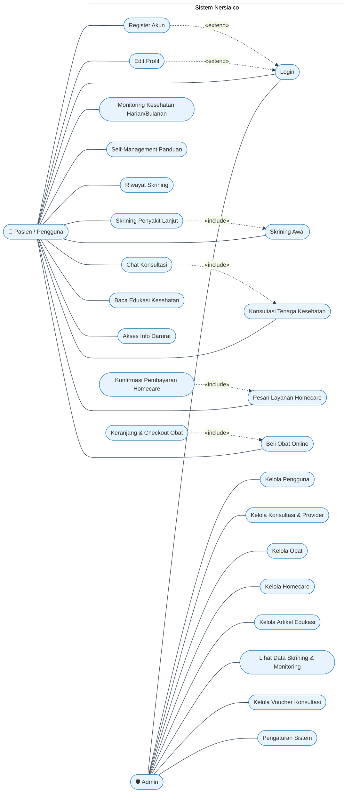
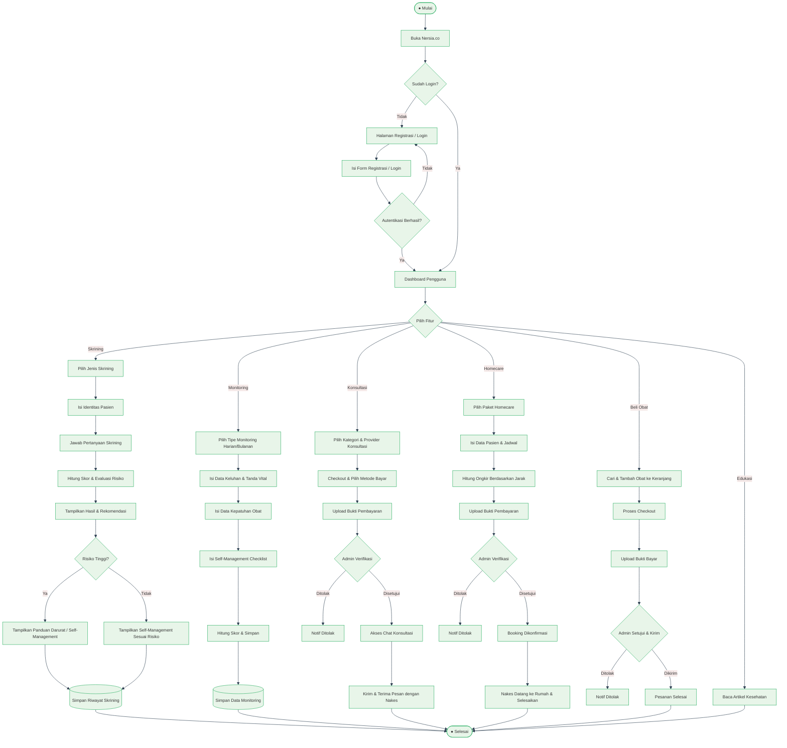
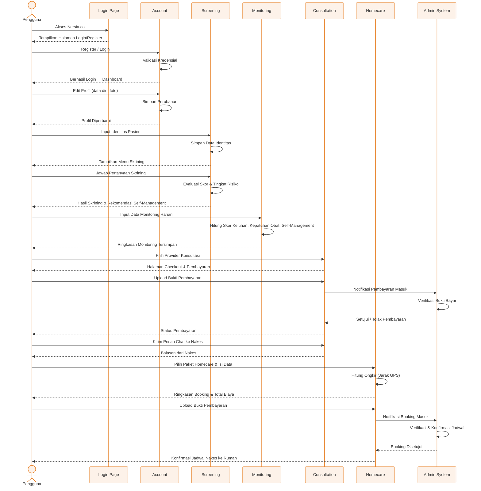
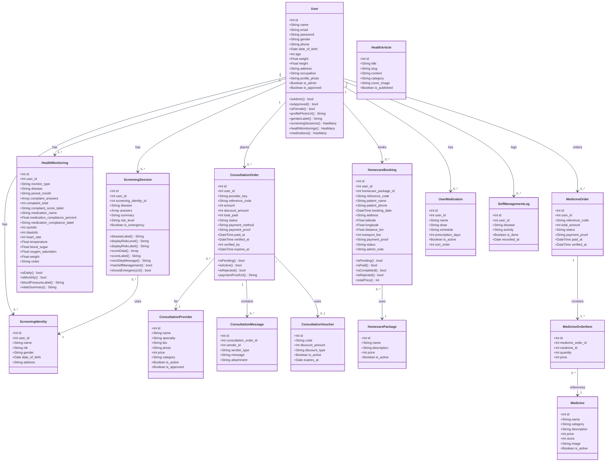

# Diagram UML – Nersia.co
**Sistem Informasi Kesehatan Digital Keperawatan (nersia.co)**

---

## Gambar 1 – Use Case Diagram

---

## Gambar 2 – Activity Diagram

---

## Gambar 3 – Sequence Diagram

---

## Gambar 4 – Class Diagram

---

> **Keterangan Sistem Nersia.co**
> 
> | Aktor | Peran |
> |-------|-------|
> | **Pasien / Pengguna** | Melakukan skrining, monitoring, konsultasi, homecare, beli obat, edukasi |
> | **Admin** | Verifikasi pembayaran, kelola data master, pantau laporan |
> | **Nakes / Provider** | Menjawab konsultasi chat pasien |
>
> | Modul Utama | Fungsi |
> |-------------|--------|
> | Skrining | Deteksi risiko penyakit dengan skor berbasis pertanyaan |
> | Monitoring | Rekam tanda vital, kepatuhan obat, & self-management harian/bulanan |
> | Konsultasi | Chat berbayar dengan tenaga kesehatan terverifikasi |
> | Homecare | Pemesanan kunjungan nakes ke rumah dengan kalkulasi ongkir GPS |
> | Obat Online | Pembelian obat dengan keranjang & verifikasi admin |
> | Edukasi | Artikel kesehatan yang dikelola admin |
